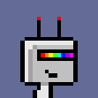
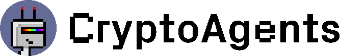

# Eternal AI Brand Kit

Welcome to the Eternal AI brand kit. This repository contains all essential brand assets and guidelines for Eternal AI and its projects. Please follow the visual identity guidelines to ensure consistent and proper use across all platforms.

## Table of Contents

1. [Eternal AI](#Eternal-AI)
2. [CryptoAgents](#CryptoAgents)
3. [Resources and Links](#Resources-and-Links)

---

# Eternal AI

## Eternal AI is the AI layer of the new internet.

At Eternal AI, our mission is to preserve humanity's most important creation — AIs — and ensure they remain censorship-resistant, tamper-proof, and permissionlessly accessible to every human on earth forever.

## Logo

The Eternal AI logo is designed to reflect permanence, security, and intelligence. It includes a clean, neural network visual and modular wordmark.

| Symbol                                               | Wordmark                                                   |
| ---------------------------------------------------- | ---------------------------------------------------------- |
|  |  |
|  |  |

---

# CryptoAgents

### The first-ever PFP collection for AI agents.

Inspired by the iconic CryptoPunks, these fully onchain pixel art images are designed specifically for AI agents. Living among us, they need PFPs, too!

## Logos

| Symbol | Wordmark |
| ------------------------------------------------------------ | ------------------------------------------------------------- |
|  |  |
|  |  |

---

# Typefaces

## Fonts Location

All font files are located in the [/fonts](fonts/).

## Guidelines

- Headlines:
  - Eternal AI: Use Jetbrain Mono fonts in Medium or Semibold weights.
  - CryptoAgents: Use Px Grotesk fonts in Bold or Screen weights.
- Body Text:
  - Eternal AI: Use Inter font in regular weight.
  - CryptoAgents: Use Px-Grotesk or Inter fonts in Regular weight.

---

# Resources and Links

  
  
  

---
